# アプリケーション説明

## ＜アプリケーション名＞

- みんなで作ろう釣り MAP in 愛知

## ＜アプリケーション概要＞

- ユーザー登録・編集ができます
- 釣果投稿が投稿・編集・削除できます
- ユーザーが登録した釣果投稿の一覧が見れます
- カテゴリー別(市町村・魚種)で検索して投稿を絞り込んで見ることができます
- 他人の投稿にコメントすることできます

## ＜ URL ＞

- https://fishing-app31534.herokuapp.com/

### ＜ Basic 認証 ID ＞

- ID: shuga
- password: 31534

### ＜ログインユーザー＞

#### ＜ユーザー 1 ＞

- メールアドレス: user1@email
- パスワード: pass123

#### ＜ユーザー 2 ＞

- メールアドレス: user2@email
- パスワード: pass123

## ＜利用方法＞

### ＜トップページ＞

- 左上、又は一番下にあるロゴ画像を押すと遷移できます。
- アプリ全体の概要について説明しているページになります。
  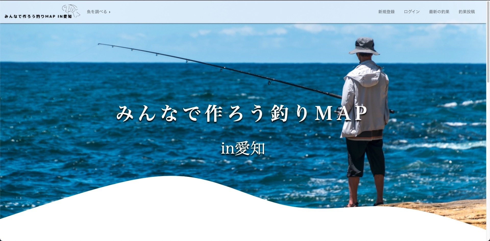
  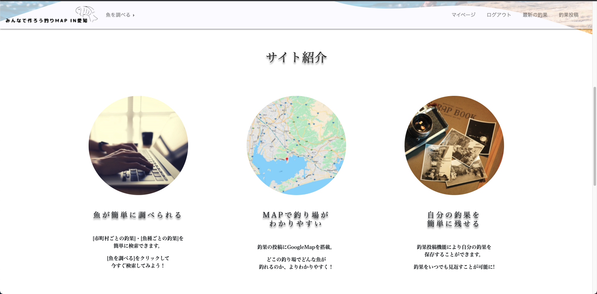
  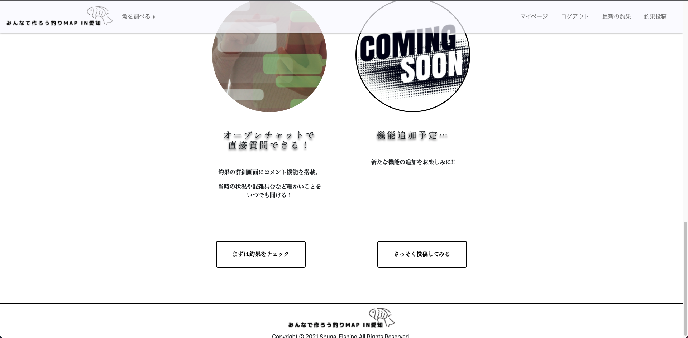

### ＜ユーザー登録＞

- トップ画面遷移後画面右上の『新規登録』ボタンを押して新規登録画面に遷移できます。
- アカウント登録することができます。
- 作成することはできますが、原則テストアカウントでのログインをお願いたします。
  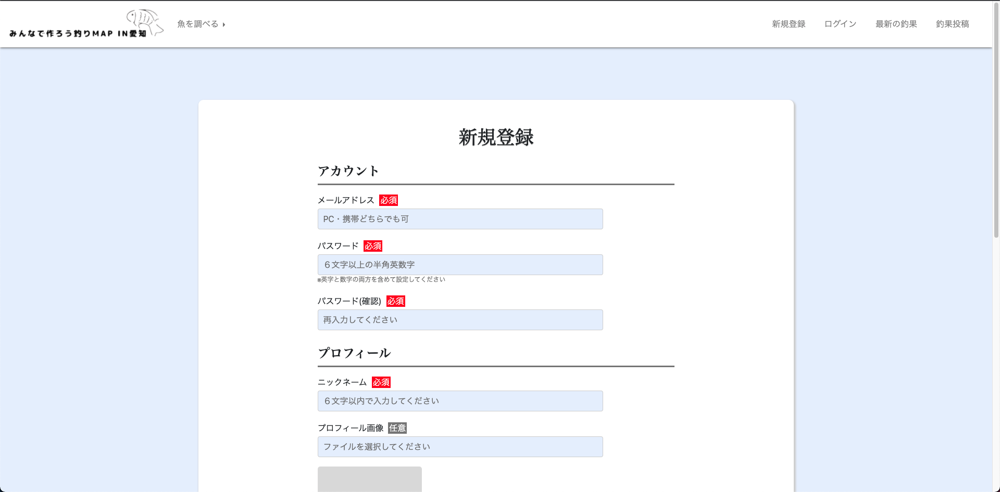
  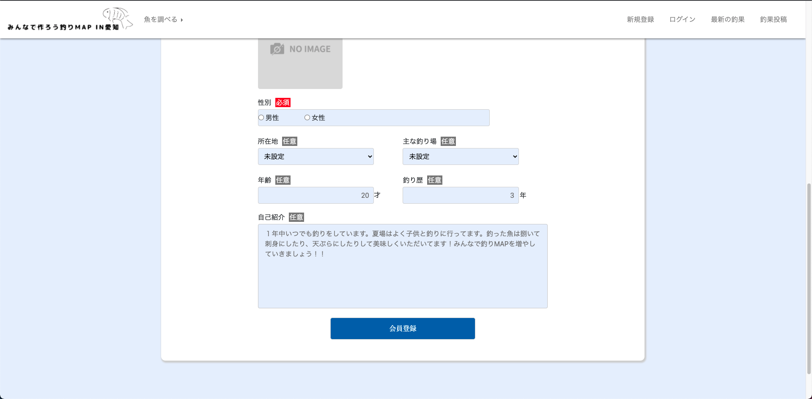

### ＜ユーザーログイン＞

- トップ画面遷移後画面右上の『ログイン』ボタンを押してログイン画面に遷移できます。
- ユーザー１又はユーザー２の情報を使用してログインできます。
- ログインすることにより、さまざまな機能が使えるようになります。
  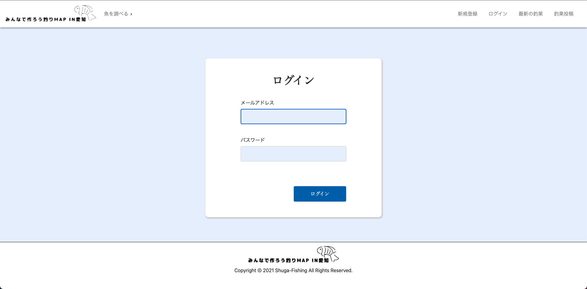

### ＜ユーザー詳細＞

- トップ画面遷移後画面右上の『マイページ』ボタンを押すとマイページ画面に遷移できます。
- 他人のマイページも見ることができます。
- 自己紹介や自分の釣果のみがまとめられたページになります。
  
  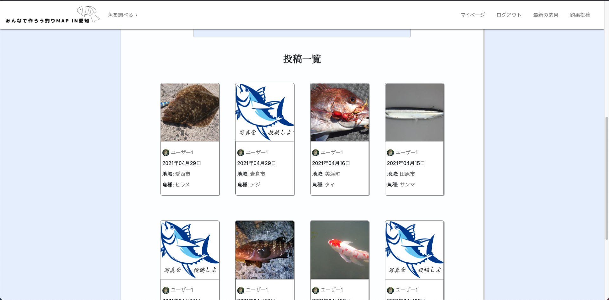

### ＜ユーザー編集＞

- ユーザー詳細ページにある『編集』ボタンを押すとユーザー編集画面に遷移できます。
- 主に自己紹介内容を編集することができます。
  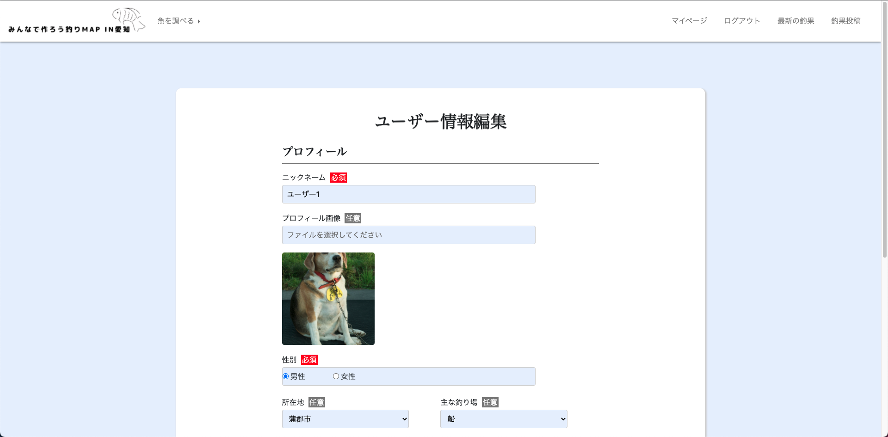
  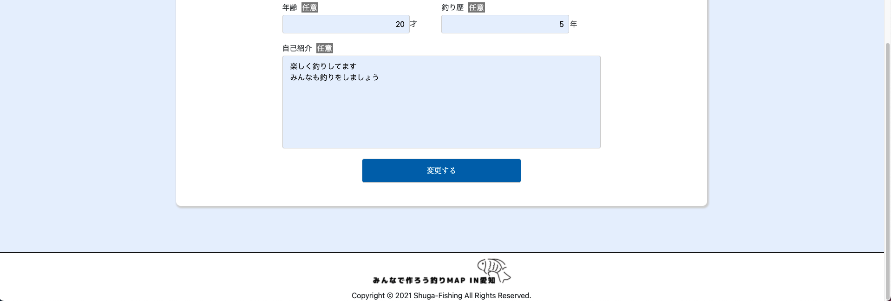

### ＜釣果投稿＞

- 右上にある『釣果投稿』ボタンを押すと釣果投稿ページに遷移できます。
- 釣果投稿では必須項目を入力していただき『投稿する』ボタンを押すと釣果が投稿できるようになっています。
  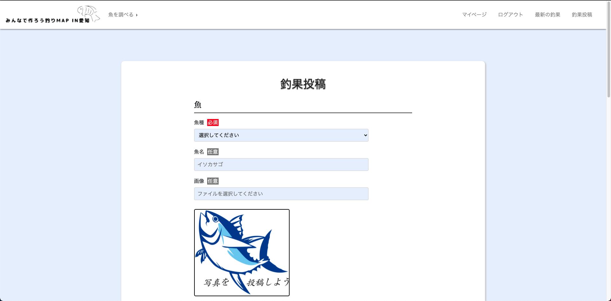
  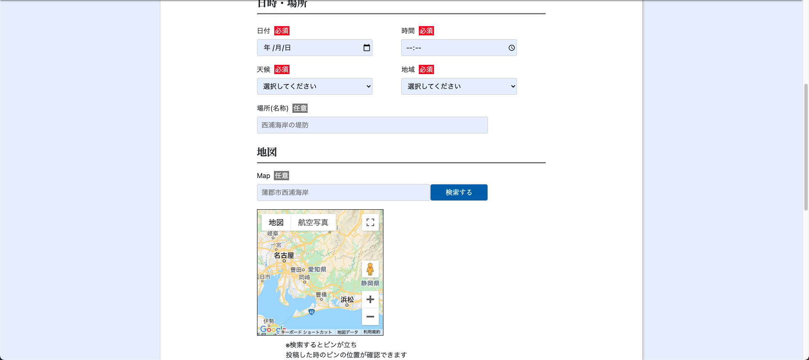
  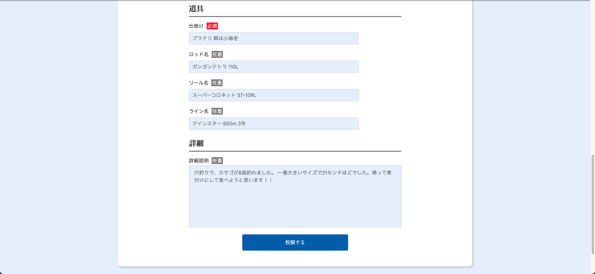

### ＜釣果一覧＞

- 右上にある『最新の釣果』ボタンを押すと詳細ページに遷移すできます。
- 投稿の画像をクリックするとクリックした釣果の詳細ページへ遷移できます。
- 同じく名前をクリックすると釣果の投稿者の詳細ページへ 魚種をクリックするとその魚種が含まれた投稿一覧ページへ 市町村をクリックするとその市町村が含まれた投稿一覧ページへ遷移するようになっています。（この機能は詳細ページにもついています）
  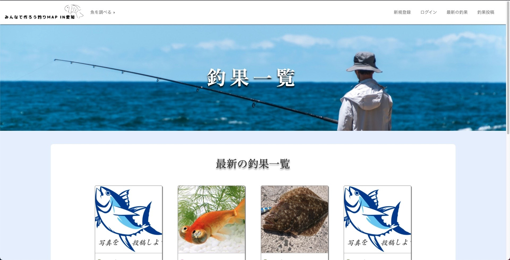
  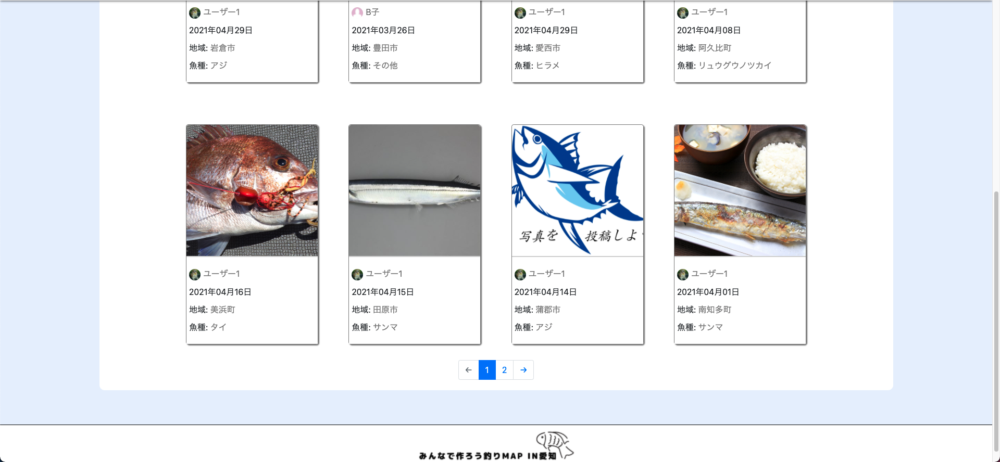

### <釣果詳細>

- 釣果が詳しく見れるページになっています。
- ユーザー同士でコメントし合うことが可能です。
  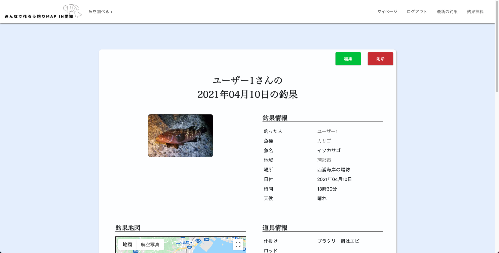
  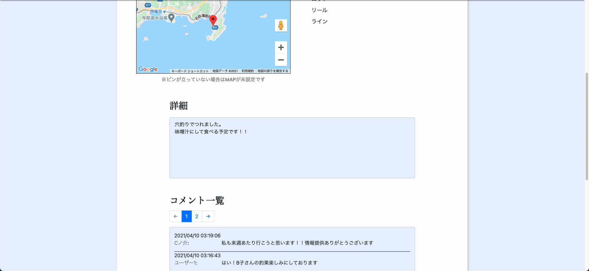
  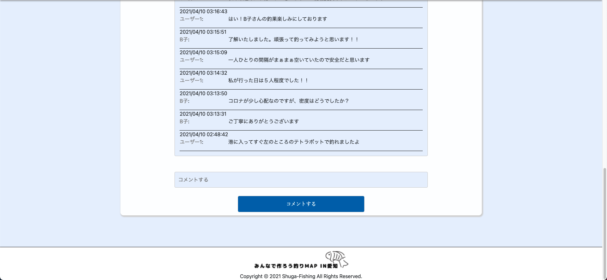

### <釣果編集>

- 釣果詳細画面にある『編集』ボタンを押すと釣果編集画面に遷移できます。
- 自分が投稿した超過の編集をすることができます。
  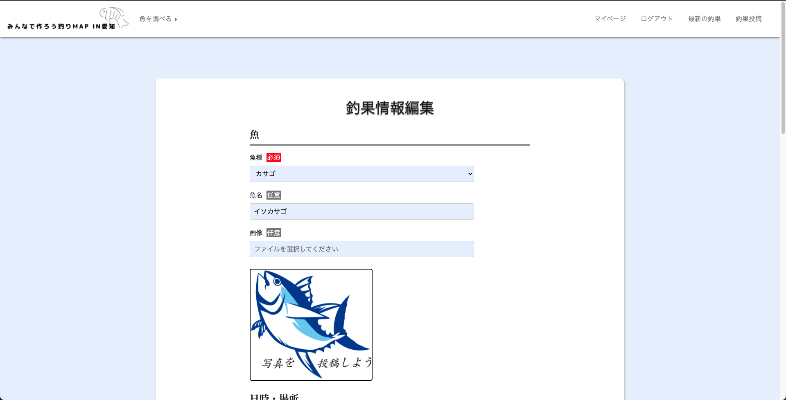
  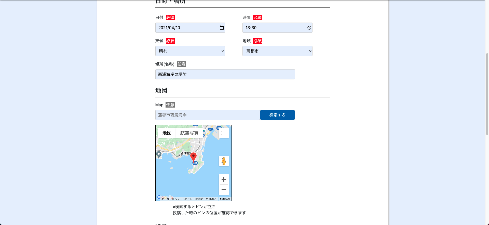
  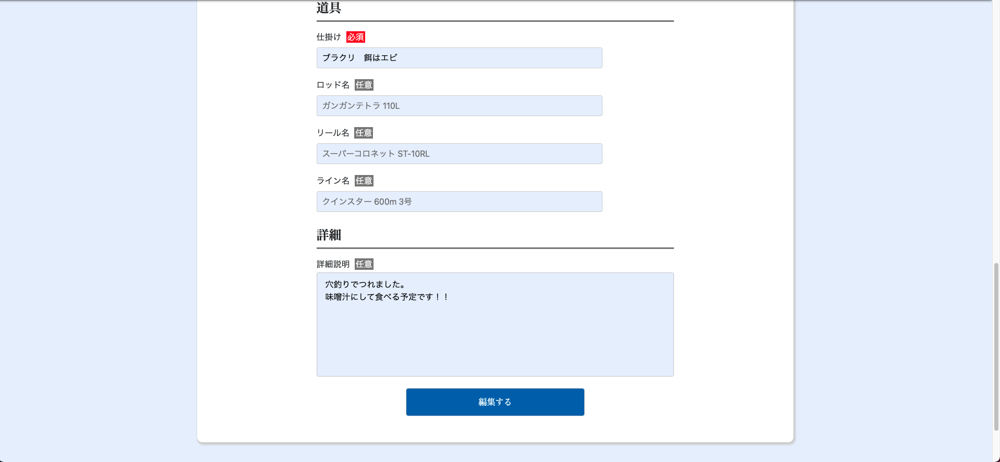

### <釣果削除>

- 釣果詳細画面にある『削除』ボタンを押すと自分が投稿した釣果を削除することができます。

## <目指した解決課題>

- ペルソナ: 私を含めた釣りを趣味としている人です。
- 解決課題: どの季節にどこでどのような仕掛けで何が釣れるのか一眼でわかるような物が無い。釣り人同士で釣果を共有しあって釣れる魚の一覧が作りたい

## <洗い出した要件>

---

# DB 設計

## users テーブル

| Column             | Type    | Options     |
| ------------------ | ------- | ----------- |
| email              | string  | null: false |
| encrypted_password | string  | null: false |
| nickname           | string  | null: false |
| gender             | string  | null: false |
| municipality_id    | integer | null: false |
| age                | integer | null: false |
| history            | integer | null: false |
| style_id           | integer | null: false |
| profile            | text    | null: false |

### Association

- has_many :posts

## posts テーブル

| Column          | Type       | Options                        |
| --------------- | ---------- | ------------------------------ |
| fishing_date    | date       | null: false                    |
| fishing_time    | time       | null: false                    |
| municipality_id | integer    | null: false                    |
| spot            | string     |                                |
| latitude        | float      |                                |
| longitude       | float      |                                |
| weather_id      | integer    | null: false                    |
| fish_kind_id    | integer    | null: false                    |
| fish_name       | string     |                                |
| gimmick         | string     |                                |
| rod             | string     |                                |
| reel            | string     |                                |
| line            | string     |                                |
| explanation     | text       |                                |
| user            | references | null: false, foreign_key: true |

### Association

- belongs_to :user

---
